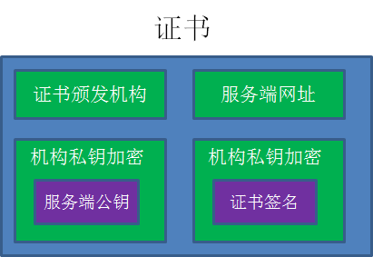
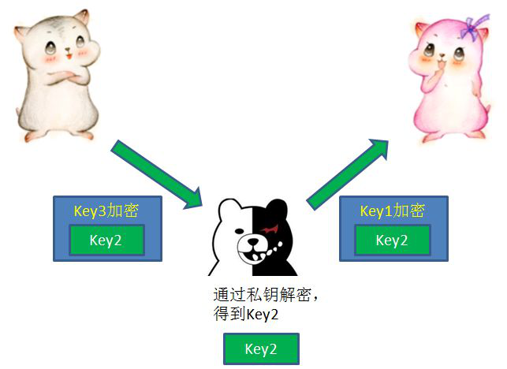

# <center>HTTP</center>
## <center></center>
## <center>简介</center>
HTTP -> HyperText Transfer Protocol 超文本传输协议，基于TCP/IP协议的应用层协议

默认的HTTP端口号是80，也就是你输入baidu.com默认访问的是baidu.com:80

具有三个特点：
1. HTTP是无连接：无连接的含义是限制每次连接只处理一个请求。服务器处理完客户的请求，并收到客户的应答后，即断开连接。采用这种方式可以节省传输时间。（我怎么记得1.1之后允许TCP连接重用）
2. HTTP是媒体独立的：这意味着，只要客户端和服务器知道如何处理的数据内容，任何类型的数据都可以通过HTTP发送。客户端以及服务器指定使用适合的MIME-type内容类型。
3. HTTP是无状态：HTTP协议是无状态协议。无状态是指协议对于事务处理没有记忆能力。缺少状态意味着如果后续处理需要前面的信息，则它必须重传，这样可能导致每次连接传送的数据量增大。另一方面，在服务器不需要先前信息时它的应答就较快。


## <center>消息结构</center>
### 请求消息结构
- 请求行
- 请求头部
- 空行
- 请求数据


### 响应消息结构
- 状态行
- 消息报头
- 空行
- 响应正文


## <center>HTTP请求方法</center>
1.0版本只有三种GET, POST 和 HEAD，1.1新增6种

|方法|功能定义|
|:-:|:-:|
|GET|请求指定的页面信息，并返回实体主体|
|HEAD|类似于 GET 请求，只不过返回的响应中没有具体的内容，用于获取报头|
|POST|向指定资源提交数据进行处理请求（例如提交表单或者上传文件）。数据被包含在请求体中。POST 请求可能会导致新的资源的建立和/或已有资源的修改|
|PUT|从客户端向服务器传送的数据取代指定的文档的内容|
|DELETE|请求服务器删除指定的页面|
|CONNECT|HTTP/1.1 协议中预留给能够将连接改为管道方式的代理服务器|
|OPTIONS|允许客户端查看服务器的性能|
|TRACE|回显服务器收到的请求，主要用于测试或诊断|
|PATCH|是对 PUT 方法的补充，用来对已知资源进行局部更新|


## <center>HTTP响应头</center>
1. Allow: 服务器支持哪些请求方法（如GET、POST等）
2. Content-Encoding: 文档的编码（Encode）方法。只有在解码之后才可以得到Content-Type头指定的内容类型。利用gzip压缩文档能够显著地减少HTML文档的下载时间
3. Content-Length :表示内容长度。只有当浏览器使用持久HTTP连接时才需要这个数据。
4. Content-Type: 表示后面的文档属于什么MIME类型。
5. Data: 当前的GMT时间。
6. Expires: 设置浏览器缓存文档的过期时间
7. Cache-Control: Expires设置的是日期时间，因此要求客户端和服务端时间一致，而1.1之后提出的 Cache-Control 解决了这个问题，可以设置缓存多少秒
8. Location：重定向？
9. Refresh：表示浏览器应该在多少时间之后刷新文档，以秒计？
10. Server：服务器名字。
11. Set-Cookie：设置和页面关联的Cookie。
12. WWW-Authenticate：客户应该在Authorization头中提供什么类型的授权信息？
13. Last-Modified：文档的最后改动时间
14. Content-Disposition：表示返回的是文件，并且设置下载方式以及下载时的默认名


## <center>状态码</center>
当浏览者访问一个网页时，浏览者的浏览器会向网页所在服务器发出请求。当浏览器接收并显示网页前，此网页所在的服务器会返回一个包含HTTP状态码的信息头（server header）用以响应浏览器的请求。
- 200 - 请求成功
- 301 - 资源（网页等）被永久转移到其它URL
- 404 - 请求的资源（网页等）不存在
- 500 - 内部服务器错误

粗略分类：
- 1**： 信息，服务器收到请求，需要请求者继续执行操作
- 2**： 成功，操作被成功接收并处理
- 3**： 重定向，需要进一步的操作以完成请求
- 4**： 客户端错误，请求包含语法错误或无法完成请求
- 5**：	服务器错误，服务器在处理请求的过程中发生了错误


## <center>状态码</center>
这太多了，直接上菜鸟：***[HTTP Content-Type](https://www.runoob.com/http/http-content-type.html "HTTP Content-Type")***


## <center>HTTP vs HTTPS</center>
1. HTTP 的URL 以http:// 开头，而HTTPS 的URL 以https:// 开头
2. HTTP 是不安全的，而 HTTPS 是安全的
3. HTTP 标准端口是80 ，而 HTTPS 的标准端口是443
4. 在OSI 网络模型中，HTTP工作于应用层，而HTTPS 的安全传输机制工作在传输层
5. HTTP 无法加密，而HTTPS 对传输的数据进行加密
6. HTTP无需证书，而HTTPS 需要CA机构wosign的颁发的SSL证书

## <center>HTTPS</center>
HTTPS = HTTP + SSL

数据段是加密过的，非明文的

对称加密：密钥同时用来加密和解密

非对称加密：公钥加密，私钥则解密；私钥加密，公钥则解密

证书组成：公证方用自身私钥加密服务端公钥以及证书签名，明文表示公证方机构，服务端网址

证书签名：公证方根据服务端网址等信息生成



HTTP到HTTPS的进化史：
1. 最初数据明文传输，数据被中途抓包就会导致数据的泄露，因此提出了对称密钥，可以通过密钥来进行加密和解密，然后双方提前发送各自的密钥即可
2. 虽然有了对称密钥，但是最初的密钥是明文的，因此当密钥被截获，就回到了起点，为了降低密钥被截获的风险，提出了非对称密钥，举例：A首先明文发送公钥给B，B用A的公钥加密自己的公钥然后发送给A，这样就只有A的公钥是明文的，降低风险
3. 非对称加密只是降低风险，并非解决问题。当上面A的公钥也被截获，hacker修改A公钥为自己的公钥，发送给B，然后再用自己的私钥解密出B的公钥，此时A,B的数据对hacker将变透明（不过此时hacker无法伪造，因为伪造需要知道两者的私钥），如果要实现伪造，则需要截获两者的所有消息并做转发，成为两者的中间件

4. 综上可以知道，只要在两者中有一次明文传输密钥，就可能造成灾难。因此出现了第三方公证，服务端先去权威证书机构注册证书，然后在交互前先发送该证书给客户端，因为操作系统和浏览器维护了所有权威证书机构的名称和公钥，所以客户端可以解密出证书签名和服务端公钥，如果证书签名正确，就可以用该公钥进行后续交互。

## <center>与python的交互（客户端）</center>
服务端一般使用web框架

Requests: ***[第三方Request模块官方中文文档](http://cn.python-requests.org/zh_CN/latest/index.html "第三方Request模块官方中文文档")***
Requests 完全满足今日 web 的需求:
- Keep-Alive & 连接池
- 国际化域名和 URL
- 带持久 Cookie 的会话
- 浏览器式的 SSL 认证
- 自动内容解码
- 基本/摘要式的身份认证
- 优雅的 key/value Cookie
- 自动解压
- Unicode 响应体
- HTTP(S) 代理支持
- 文件分块上传
- 流下载
- 连接超时
- 分块请求
- 支持 .netrc
- 不需要手动为 URL 添加查询字串，也不需要对 POST 数据进行表单编码。Keep-alive 和 HTTP 连接池的功能是 100% 自动化的

支持的请求方法：
```
request(method, url, **kwargs)
get(url, params=None, **kwargs) -> request('get', url, params=params, **kwargs)
options(url, **kwargs)          -> request('options', url, **kwargs)
head(url, **kwargs)             -> request('head', url, **kwargs)
post(url, data=None, json=None, **kwargs) -> request('post', url, data=data, json=json, **kwargs)
put(url, data=None, **kwargs)   -> request('put', url, data=data, **kwargs)
patch(url, data=None, **kwargs) -> request('patch', url, data=data, **kwargs)
delete(url, **kwargs)           -> request('delete', url, **kwargs)
```

```
Request对象属性
class Request(RequestHooksMixin):
    def __init__(self,
                method=None, url=None, headers=None, files=None, data=None,
                params=None, auth=None, cookies=None, hooks=None, json=None):


method  -> str                  #请求方法
url     -> str                  #请求地址
headers -> dict                 #请求头
files   -> dict/list            #POST上传文件
    multiple_files = [
        ('images', ('foo.png', open('foo.png', 'rb'), 'image/png')),
        ('images', ('bar.png', open('bar.png', 'rb'), 'image/png'))]    #最好以二进制模式打开文件
    r = requests.post('http://httpbin.org/post', files=multiple_files)

data    -> dict                 #模拟HTML表单数据
params  -> dict                 #URL 参数，自动构建URL
    payload = {'key1': 'value1', 'key2': ['value2', 'value3']}
    r = requests.get('http://httpbin.org/get', params=payload)
    http://httpbin.org/get?key1=value1&key2=value2&key2=value3

auth    -> HTTPDigestAuth/HTTPBasicAuth/自定义  #指定身份验证机制，关于username/password的编码格式
cookies -> dict                 #设置cookie
hooks   -> dict                 #设置钩子函数
    def print_url(r, *args, **kwargs):  # r是传入的response
        print(r.url)
    requests.get('http://httpbin.org', hooks=dict(response=print_url))

json    -> dict                 #自动将dict按json格式编码
```

```
Response对象属性
class Response(object):
    __attrs__ = [
        '_content', 'status_code', 'headers', 'url', 'history',
        'encoding', 'reason', 'cookies', 'elapsed', 'request'
    ]

    _content    # Response提供了接口类 content() , 返回二进制的内容，不应该使用这个属性
    text()      # 返回unicode编码的内容，如果encoding为空，会使用chardet模块来猜编码
    history     # 返回某个请求的历史response对象list，重定向会？？？
    reason      # 返回文本类型的状态，e.g. "Not Found" or "OK"
    elappsed    # 返回 发送request 到 收到response的时间
    request     # response 对象对应的 request？？？
```


## <center>与django的交互</center>
### 配置URL
在app.urls.py文件编辑URL如下格式，然后再在去project.urls那里引入即可

```
# urls.py
from django.urls import path
from . import views
urlpatterns = [
    path('articles/2003/', views.special_case_2003),
    path('articles/<int:year>/', views.year_archive),
    path('articles/<int:year>/<int:month>/', views.month_archive)]
```

### 视图 函数
视图：
```
# views.py
from django.http import HttpResponse
def my_view(request):
    return HttpResponse(status=201) # Return a "created" (201) response code.
```

### django.http.HttpRequest
***[HttpRequest类属性官方文档](https://docs.djangoproject.com/en/dev/ref/request-response/#django.http.HttpRequest "HttpRequest类属性官方文档")***

当请求到来时，django会创建一个 HttpRequest 对象来包含请求的元数据，然后将这个 HttpRequest 对象作为视图函数的第一个参数
```
# from django.http.request import HttpRequest / from django.http import HttpRequest（http目录的__init__文件引入了HttpRequest类）
# django.http.request.py
class HttpRequest:
    # A basic HTTP request对象. #

scheme             -> str                                   # 模式，HTTP 还是 HTTPS
body               -> bytes                                 # 二进制表示，原生 HTTP 请求数据
path               -> str                                   # 请求的完整URL，不包括模式和域名，例如："/music/bands/the_beatles/"
path_info          -> str                                   # 请求的 URL ，只包括 WSGIServer 发送到app的URL
method             -> str                                   # 请求方法
encoding           -> str                                   # 请求数据的编码方式，如果是 None 则使用 DEFAULT_CHARSET 默认字符配置
content_type       -> str                                   # ????
GET                -> QueryDict: Dict like                  # 包含了 GET 请求提交的所有参数，ps：QueryDict 是 Dict 的子类，解决了 HTML 复选框这种一个 KEY 多个 Value 参数的 Dict 冲突
POST               -> QueryDict: Dict like                  # 包含 POST 提交的表单数据，不包括上传的文件
COOKIES            -> dict                                  # 包含了所有的 cookies
FILES              -> MultiValueDict: Dict like             # 包含了所有上传的文件，key 是上传时表单上的 name，value 是一个 UploadedFile 对象，只有当 POST 的 Content-Type 是 "multipart/form-data" 格式的时候才会有数据，ps:MultiValueDict 是 Dict 的子类，
```

### django.http.HttpResponse
***[HttpResponse类属性官方文档](https://docs.djangoproject.com/en/dev/ref/request-response/#django.http.HttpResponse "HttpResponse类属性官方文档")***

***[StreamingHttpResponse类属性官方文档](https://docs.djangoproject.com/en/dev/ref/request-response/#django.http.StreamingHttpResponse "StreamingHttpResponse")***

服务端的工作就是根据请求，构造响应数据并返回

设置响应正文，可以传入string，bytestring 或者 memoryview对象 以及所有的可迭代对象
```
from django.http import HttpResponse
response = HttpResponse("Here's the text of the Web page.")
response = HttpResponse(b'Bytestrings are also accepted.')
response = HttpResponse(memoryview(b'Memoryview as well.'))

# 如果初始化之后希望增加正文，可以像文件一样写入
response = HttpResponse()
response.write("<p>Here's the text of the Web page.</p>")

# 如果传入一个可迭代对象，HttpResponse 会马上将其迭代并将结果以str返回，最后如果有 close() 的对象还会马上关闭，例如 file() 对象，如果希望以 stream 流的形式返回给客户端，则需要用到 StreamingHttpResponse 对象
```

设置响应的消息报头，用法跟字典一样，不过对于 Cache-Control 和 Vary 推荐使用 django.utils.cache.patch_cache_control() 和 django.utils.cache.patch_vary_headers()，因为这两个响应头能有多个独立的值，上面两个方法能避免中间件的设置不被覆盖
```
response = HttpResponse()
response['Age'] = 120       # 不允许有换行符
del response['Age']         # 即使没有该字段删除也不会抛出异常，这点跟 dict 不同

# 如果希望返回一个文件，则需要设置 Content-Type 为对应值，并且设置 Content-Disposition 响应头，例如下面返回一个xls文件
response = HttpResponse(my_data, content_type='application/vnd.ms-excel')
response['Content-Disposition'] = 'attachment; filename="foo.xls"'
```

HttpResponse 属性
```
content             -> bytes  # 返回内容
charset             -> str    # 字符集
status_code         -> int    # 返回状态码
reason_phrase       -> str    # 与状态码配对的文本，不设置则自动使用默认标准
streaming           -> bool   # 为了方便区分是 HttpResponse 对象还是 StreamingHttpResponse 对象，前者是 False , 后者是 True
closed              -> bool   # 如果为True则表明 Response 对象相关的属性都已经关闭
```

### django.http.StreamingHttpResponse
StreamingHttpResponse 和 HttpResponse 都是 HttpResponseBase 的子类

前面说了当 HttpResponse 用当可迭代对象初始化的时候会直接执行完该可迭代对象，但是当一个可迭代对象非常大的时候（例如一个大CSV数据文件），内存会崩溃，此时就可以使用 Stream 流式传输

StreamingHttpResponse 与 HttpResponse 几乎一样，但有以下差别
- 只能传入可迭代对象，并且每次 yield 返回的 string 会作为传输内容
- 只能通过传入的可迭代对象来获取传输内容（HttpResponse初始化之后可以访问content属性）
- 没有 content 属性，只有 streaming_contetn 属性
- 不能像 file-like 对象那样调用 tell(), write()方法在初始化后添加返回内容