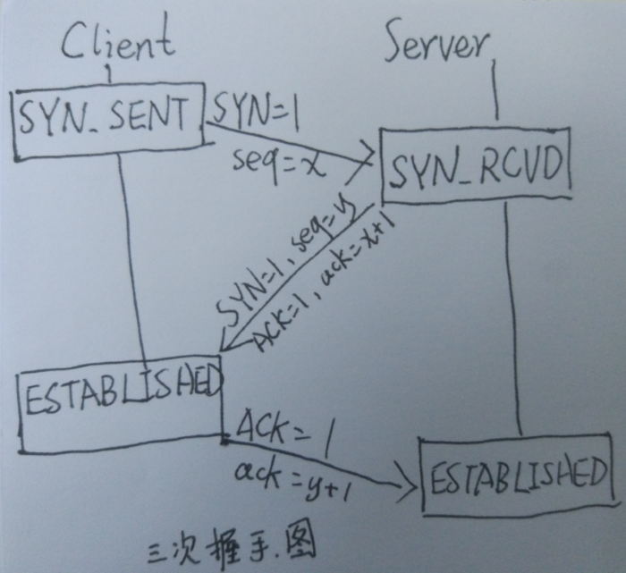
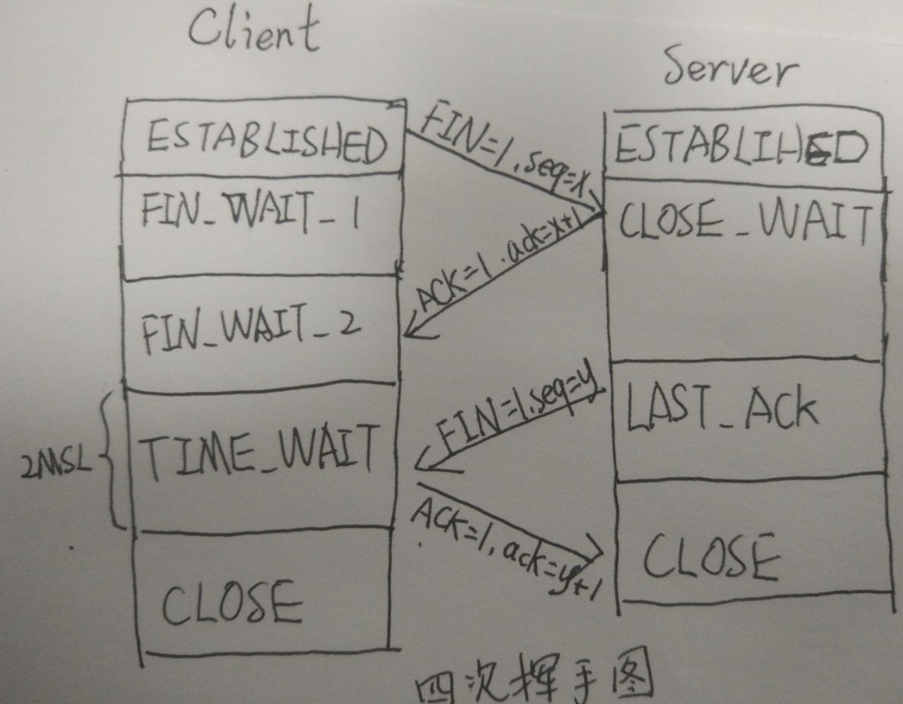

# 三次握手
状态转换 (SYN_SENT,SYN_RCVD,ESTABLISHED)

发包内容 ({SYN=1,seq=x},{SYN=1,ACK=1,seq=x+1,ack=y},{ACK=1,ack=y+1})

# 四次挥手
状态转换 (ESTABLISHED,FIN_WAIT_1,FIN_WAIT_2,TIME_WAIT,CLOSE,CLOSE_WAIT,LAST_ACK)

发包内容 ({FIN=1,seq=x},{ACK=1,ack=x+1},{FIN=1,seq=y},{ACK=1,ack=y+1})

Client那个 TIME_WAIT 状态，会等待 2MSL 的时间，目的是为了防止 Client 响应报文丢失，因为如果丢失的话，Server会重新发送结束报文，然后 Client 就知道他的响应报文没有被收到了。

# TCP vs UDP
TCP：面向连接，可靠，基于字节流

UDP：无连接，不可靠，基于报文

# wireshark